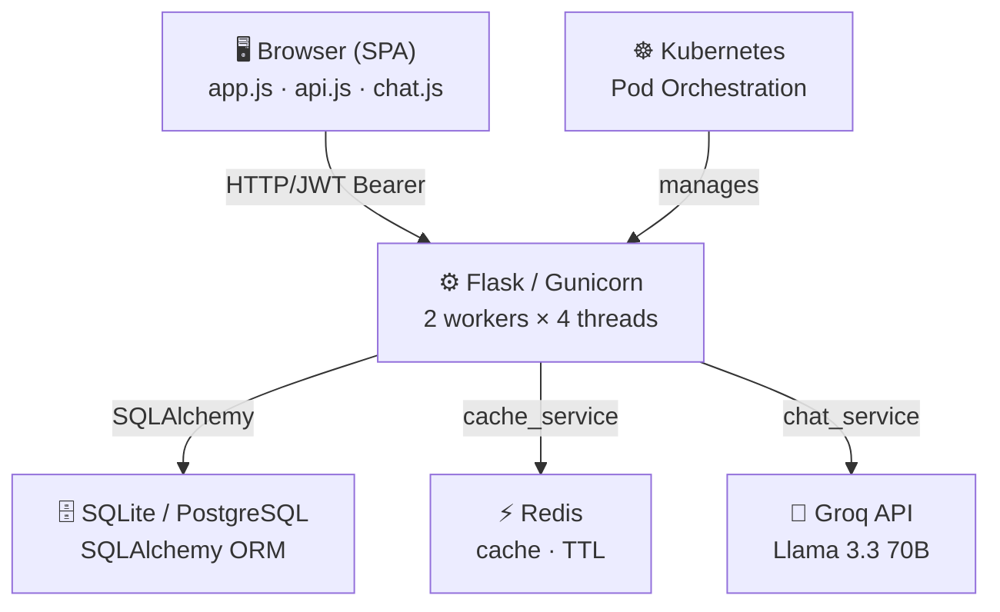
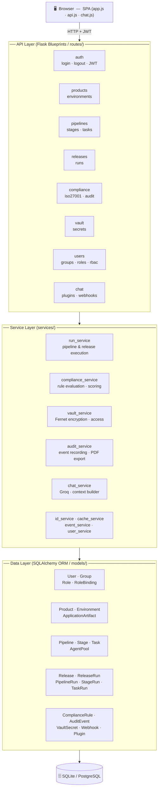
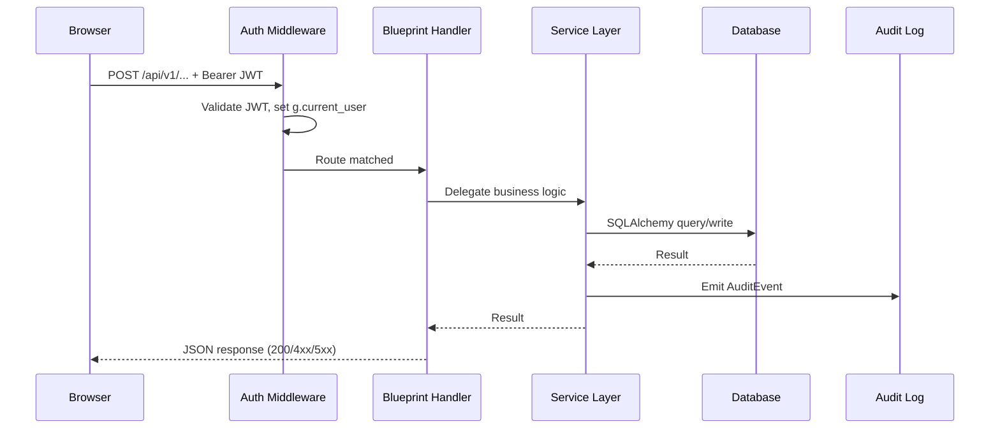
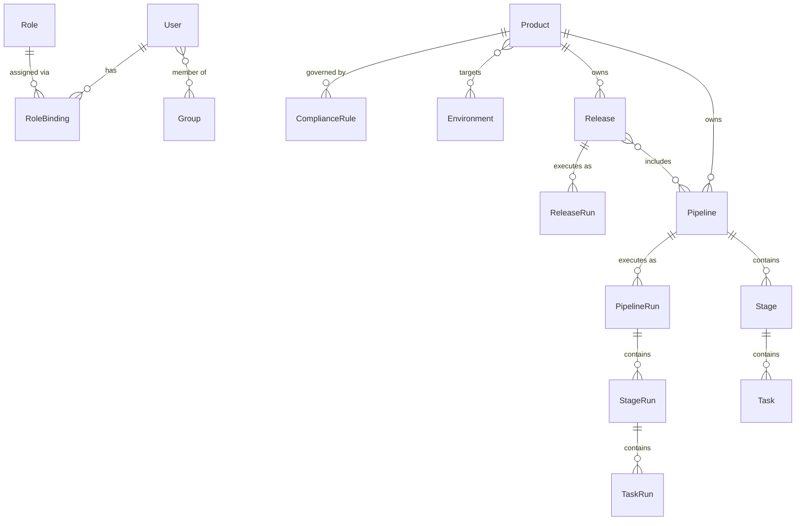
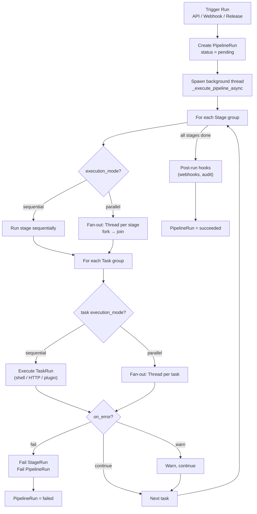
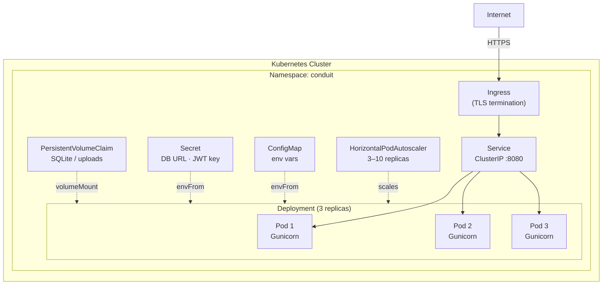
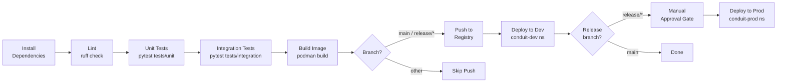

# Conduit — Technical Documentation

**Version:** 1.1
**Stack:** Python 3.12 · Flask 3.1 · SQLAlchemy · Gunicorn · UBI 9 · Kubernetes
**Last updated:** 2026-04-01

---

## Table of Contents

1. [Overview](#1-overview)
2. [Architecture](#2-architecture)
3. [Project Structure](#3-project-structure)
4. [Data Models](#4-data-models)
5. [API Reference](#5-api-reference)
6. [Authentication & Authorization](#6-authentication--authorization)
7. [Configuration](#7-configuration)
8. [Services](#8-services)
9. [Frontend](#9-frontend)
10. [AI Chat Assistant](#10-ai-chat-assistant)
11. [ISO 27001:2022 Compliance Engine](#11-iso-270012022-compliance-engine)
12. [Vault (Secrets Management)](#12-vault-secrets-management)
13. [Webhooks](#13-webhooks)
14. [Plugins & Integrations](#14-plugins--integrations)
15. [YAML Export / Import & Git Sync](#15-yaml-export--import--git-sync)
16. [Running Locally](#16-running-locally)
17. [Container Build](#17-container-build)
18. [Kubernetes Deployment](#18-kubernetes-deployment)
19. [Helm Chart](#19-helm-chart)
20. [Terraform](#20-terraform)
21. [CI/CD Pipeline](#21-cicd-pipeline)
22. [Testing](#22-testing)
23. [Database Migrations](#23-database-migrations)
24. [Seed Data](#24-seed-data)
25. [Dependency Reference](#25-dependency-reference)

---

## 1. Overview

Conduit is a self-hosted CI/CD orchestration and compliance platform designed to run natively on Kubernetes. It provides a unified control plane for managing the full software delivery lifecycle:

- **Products** group applications and own their pipelines and releases.
- **Pipelines** define ordered stages and tasks that execute code in sandboxed agent pools.
- **Releases** assemble one or more pipelines, gate promotion via compliance admission rules, and execute coordinated release runs.
- **RBAC** enforces zero-trust access with scoped role bindings and Just-In-Time (JIT) elevation.
- **Compliance** evaluates every pipeline and release against configurable admission rules and the full ISO/IEC 27001:2022 Annex A control catalogue.
- **Vault** stores Fernet-encrypted secrets with per-secret access control.
- **AI Assistant** uses Groq (Llama 3.3 70B) to answer natural-language questions about platform data.

---

## 2. Architecture

### System Context



### Application Layers



### Request Flow



---

## 3. Project Structure

```
conduit/
├── app/
│   ├── __init__.py            # Application factory (create_app)
│   ├── config.py              # Config class — environment variable mapping
│   ├── extensions.py          # db, migrate singletons
│   ├── domain/
│   │   └── enums.py           # RunStatus, ComplianceRating, Persona, …
│   ├── models/                # SQLAlchemy ORM models
│   │   ├── auth.py            # User, Group, Role, RoleBinding
│   │   ├── product.py         # Product
│   │   ├── environment.py     # Environment, product_environments
│   │   ├── pipeline.py        # Pipeline, Stage
│   │   ├── task.py            # Task, TaskRun, AgentPool
│   │   ├── release.py         # Release, ReleaseApplicationGroup, release_pipelines
│   │   ├── run.py             # PipelineRun, ReleaseRun, StageRun
│   │   ├── application.py     # ApplicationArtifact
│   │   ├── compliance.py      # ComplianceRule, AuditEvent
│   │   ├── plugin.py          # Plugin, PluginConfig
│   │   ├── vault.py           # VaultSecret
│   │   ├── webhook.py         # Webhook, WebhookDelivery
│   │   └── setting.py         # PlatformSetting
│   ├── routes/                # Flask Blueprints (API layer)
│   │   ├── health.py          # GET /healthz, GET /readyz
│   │   ├── main.py            # GET / → serves SPA shell
│   │   ├── auth.py            # /api/v1/auth/*
│   │   ├── users.py           # /api/v1/users, /groups, /roles
│   │   ├── products.py        # /api/v1/products
│   │   ├── environments.py    # /api/v1/environments
│   │   ├── pipelines.py       # /api/v1/products/*/pipelines
│   │   ├── releases.py        # /api/v1/products/*/releases
│   │   ├── runs.py            # /api/v1/*/runs, /pipeline-runs/*, /release-runs/*
│   │   ├── agents.py          # /api/v1/agent-pools, task execution
│   │   ├── plugins.py         # /api/v1/plugins
│   │   ├── vault.py           # /api/v1/vault
│   │   ├── webhook.py         # /api/v1/webhooks
│   │   ├── compliance.py      # /api/v1/compliance
│   │   ├── settings.py        # /api/v1/settings
│   │   ├── chat.py            # /api/v1/chat
│   │   ├── yaml_io.py         # export/import/git sync
│   │   └── swagger.py         # Swagger UI + openapi.json
│   ├── services/              # Business logic layer
│   ├── static/
│   │   ├── css/main.css
│   │   └── js/
│   │       ├── app.js         # SPA router, page renderers, modals
│   │       ├── api.js         # Fetch-based typed API client
│   │       └── chat.js        # Floating chat widget + voice input
│   └── templates/
│       └── index.html         # SPA shell (loads app.js, api.js, chat.js)
├── scripts/
│   └── seed_data.py           # Full demo dataset seeder
├── tests/
│   ├── unit/                  # Fast, no-I/O tests
│   └── integration/           # Tests against real SQLite DB
├── k8s/                       # Raw Kubernetes manifests
├── helm/conduit/       # Helm chart
├── terraform/                 # Terraform (kubernetes provider)
├── docs/                      # This documentation
├── Dockerfile                 # Multi-stage UBI 9 build
├── wsgi.py                    # Gunicorn / dev-server entry point
├── requirements.txt           # Pinned runtime dependencies
├── requirements-dev.txt       # Dev / test tools
├── requirements-prod.txt      # PostgreSQL driver (psycopg2-binary)
└── pyproject.toml             # ruff + pytest config
```

---

## 4. Data Models

### Entity Relationship Overview



### 4.1 User & Authorization

#### User
| Column | Type | Notes |
|--------|------|-------|
| `id` | VARCHAR(64) PK | `usr_<ULID>` |
| `username` | VARCHAR(64) UNIQUE NOT NULL | Login identifier |
| `email` | VARCHAR(255) | Optional |
| `display_name` | VARCHAR(128) | Display name |
| `password_hash` | TEXT | bcrypt hash (cost 12) |
| `ldap_dn` | TEXT | Distinguished name for LDAP users |
| `persona` | VARCHAR(64) | See Persona enum below |
| `is_active` | BOOLEAN | Default true |
| `is_builtin` | BOOLEAN | Default false — built-in users cannot be deleted |
| `last_login` | DATETIME | UTC |
| `created_at` | DATETIME | UTC |

**Persona enum:** `PlatformAdmin · ProductOwner · ReleaseManager · PipelineAuthor · Deployer · Approver · ComplianceAdmin · ReadOnly`

**Relationships:** `groups` (M2M via `user_groups`), `role_bindings` (1:M)

#### Group
| Column | Type | Notes |
|--------|------|-------|
| `id` | VARCHAR(64) PK | `grp_<ULID>` |
| `name` | VARCHAR(128) UNIQUE NOT NULL | |
| `description` | TEXT | |
| `ldap_dn` | TEXT | Synced from LDAP |
| `git_source` | TEXT | e.g. GitHub team URL |
| `created_at` | DATETIME | UTC |

**Relationships:** `users` (M2M), `role_bindings` (1:M)

#### Role
| Column | Type | Notes |
|--------|------|-------|
| `id` | VARCHAR(64) PK | `role_<ULID>` |
| `name` | VARCHAR(128) UNIQUE NOT NULL | |
| `permissions` | TEXT | Comma-separated permission list |
| `description` | TEXT | |
| `is_builtin` | BOOLEAN | Default false — built-in roles cannot be deleted or renamed |

#### RoleBinding
| Column | Type | Notes |
|--------|------|-------|
| `id` | VARCHAR(64) PK | |
| `role_id` | FK → Role | |
| `user_id` | FK → User (nullable) | Either user or group |
| `group_id` | FK → Group (nullable) | Either user or group |
| `scope` | TEXT | `organization`, `product:<id>`, `environment:<id>` |
| `expires_at` | DATETIME (nullable) | JIT elevation expiry |

---

### 4.2 Products & Releases

#### Product
| Column | Type | Notes |
|--------|------|-------|
| `id` | VARCHAR(64) PK | `prod_<ULID>` |
| `name` | VARCHAR(255) NOT NULL | |
| `description` | TEXT | |
| `created_at` | DATETIME | UTC |
| `updated_at` | DATETIME | UTC |

**Relationships:** `releases` (1:M cascade), `pipelines` (1:M cascade), `environments` (M2M via `product_environments`), `applications` (1:M cascade)

#### Release
| Column | Type | Notes |
|--------|------|-------|
| `id` | VARCHAR(64) PK | `rel_<ULID>` |
| `product_id` | FK → Product | |
| `name` | VARCHAR(255) NOT NULL | |
| `version` | VARCHAR(64) | SemVer string |
| `description` | TEXT | |
| `definition_sha` | VARCHAR(64) | SHA of YAML definition at creation |
| `protected_segment_version` | VARCHAR(64) | Immutable after first run |
| `created_by` | VARCHAR(128) | Username |
| `created_at` | DATETIME | |
| `updated_at` | DATETIME | |

**Relationships:** `pipelines` (M2M via `release_pipelines`), `runs` (1:M cascade), `application_groups` (1:M cascade)

#### ReleaseApplicationGroup
| Column | Type | Notes |
|--------|------|-------|
| `id` | VARCHAR(64) PK | |
| `release_id` | FK → Release | |
| `application_id` | FK → ApplicationArtifact | |
| `execution_mode` | VARCHAR(32) | `sequential` or `parallel` |
| `pipeline_ids` | TEXT (JSON array) | Ordered list of pipeline IDs |
| `order` | INTEGER | Execution order among groups |

---

### 4.3 Pipelines & Stages

#### Pipeline
| Column | Type | Notes |
|--------|------|-------|
| `id` | VARCHAR(64) PK | `pl_<ULID>` |
| `product_id` | FK → Product | |
| `application_id` | FK → ApplicationArtifact (nullable) | Optional association |
| `name` | VARCHAR(255) NOT NULL | |
| `kind` | VARCHAR(16) | `ci` or `cd` |
| `git_repo` | TEXT | Git repository URL |
| `git_branch` | VARCHAR(128) | Default: `main` |
| `definition_sha` | VARCHAR(64) | SHA of current YAML definition |
| `protected_segment_version` | VARCHAR(64) | Immutable after locking |
| `compliance_score` | FLOAT | 0.0 – 1.0 |
| `compliance_rating` | VARCHAR(32) | `Bronze · Silver · Gold · Platinum` |
| `created_at` | DATETIME | |
| `updated_at` | DATETIME | |

**Relationships:** `stages` (1:M cascade, ordered by `order`), `runs` (1:M cascade)

#### Stage
| Column | Type | Notes |
|--------|------|-------|
| `id` | VARCHAR(64) PK | |
| `pipeline_id` | FK → Pipeline | |
| `name` | VARCHAR(255) NOT NULL | |
| `order` | INTEGER | Execution order (0-based) |
| `execution_mode` | VARCHAR(16) | `sequential` (default) or `parallel` — consecutive parallel stages run concurrently |
| `accent_color` | VARCHAR(16) | Hex color for the pipeline visual card |
| `container_image` | TEXT | Docker image for sandbox |
| `run_language` | VARCHAR(32) | `python · node · bash` |
| `run_code` | TEXT | Inline script |
| `run_file` | TEXT | Path to script file |
| `sandbox_cpu` | VARCHAR(16) | Default `500m` |
| `sandbox_memory` | VARCHAR(16) | Default `256Mi` |
| `sandbox_timeout` | INTEGER | Seconds, default 60 |
| `sandbox_network` | BOOLEAN | Network access in sandbox |
| `input_schema` | TEXT (JSON) | JSON Schema for stage inputs |
| `output_schema` | TEXT (JSON) | JSON Schema for stage outputs |
| `is_protected` | BOOLEAN | Locks stage from modification |

#### Task
| Column | Type | Notes |
|--------|------|-------|
| `id` | VARCHAR(64) PK | `task_<ULID>` |
| `stage_id` | FK → Stage | |
| `name` | VARCHAR(255) NOT NULL | |
| `description` | TEXT | |
| `order` | INTEGER | Execution order within stage |
| `run_language` | VARCHAR(32) | `bash · python` |
| `run_code` | TEXT | Inline code to execute |
| `execution_mode` | VARCHAR(32) | `sequential` (default) or `parallel` — consecutive parallel tasks within a stage run concurrently |
| `on_error` | VARCHAR(32) | `fail · warn · continue` |
| `timeout` | INTEGER | Seconds, default 300 |
| `is_required` | BOOLEAN | Fail stage on task failure |
| `task_type` | VARCHAR(256) | Comma-separated type tags: `build · unit-test · integration-test · sast · sca · deploy · notify · …` — used for maturity scoring |

---

### 4.4 Execution Runs

#### PipelineRun
| Column | Type | Notes |
|--------|------|-------|
| `id` | VARCHAR(64) PK | `plrun_<ULID>` |
| `pipeline_id` | FK → Pipeline | |
| `release_run_id` | FK → ReleaseRun (nullable) | Set when part of release run |
| `status` | VARCHAR(32) | `pending · running · success · failed · cancelled` |
| `commit_sha` | VARCHAR(64) | Git commit that triggered the run |
| `artifact_id` | VARCHAR(128) | Artifact reference (e.g. image tag) |
| `compliance_rating` | VARCHAR(32) | Rating at run time |
| `compliance_score` | FLOAT | Score at run time |
| `triggered_by` | VARCHAR(128) | Username or `webhook:<name>` |
| `runtime_properties` | TEXT (JSON) | Arbitrary key/value context |
| `started_at` | DATETIME | |
| `finished_at` | DATETIME | |

#### ReleaseRun
| Column | Type | Notes |
|--------|------|-------|
| `id` | VARCHAR(64) PK | `rrun_<ULID>` |
| `release_id` | FK → Release | |
| `status` | VARCHAR(32) | Same status enum as PipelineRun |
| `compliance_rating` | VARCHAR(32) | Aggregate of all pipelines |
| `compliance_score` | FLOAT | Aggregate score |
| `triggered_by` | VARCHAR(128) | Username |
| `started_at` | DATETIME | |
| `finished_at` | DATETIME | |

#### StageRun
| Column | Type | Notes |
|--------|------|-------|
| `id` | VARCHAR(64) PK | |
| `pipeline_run_id` | FK → PipelineRun | |
| `stage_id` | FK → Stage | |
| `status` | VARCHAR(32) | Status enum |
| `started_at` | DATETIME | |
| `finished_at` | DATETIME | |
| `logs_ref` | TEXT | Log storage reference |
| `exit_code` | INTEGER | Container exit code |
| `runtime_properties` | TEXT (JSON) | Captured outputs |

#### TaskRun
| Column | Type | Notes |
|--------|------|-------|
| `id` | VARCHAR(64) PK | `trun_<ULID>` |
| `task_id` | FK → Task | |
| `stage_run_id` | FK → StageRun (nullable) | |
| `status` | VARCHAR(32) | Status enum |
| `return_code` | INTEGER | Process exit code |
| `logs` | TEXT | Captured stdout/stderr |
| `output_json` | TEXT (JSON) | Structured output |
| `user_input` | TEXT (JSON) | Input parameters |
| `agent_pool_id` | FK → AgentPool (nullable) | Pool used for execution |
| `started_at` | DATETIME | |
| `finished_at` | DATETIME | |

#### AgentPool
| Column | Type | Notes |
|--------|------|-------|
| `id` | VARCHAR(64) PK | |
| `name` | VARCHAR(128) UNIQUE | `bash-default · python-default` (built-ins) |
| `description` | TEXT | |
| `pool_type` | VARCHAR(32) | `builtin · custom` |
| `cpu_limit` | VARCHAR(16) | Default `500m` |
| `memory_limit` | VARCHAR(16) | Default `256Mi` |
| `max_agents` | INTEGER | Default 5 |
| `sandbox_network` | BOOLEAN | |
| `is_active` | BOOLEAN | |
| `created_at` | DATETIME | |

---

### 4.5 Artifacts, Compliance & Misc

#### ApplicationArtifact
| Column | Type | Notes |
|--------|------|-------|
| `id` | VARCHAR(64) PK | `app_<ULID>` |
| `product_id` | FK → Product | |
| `name` | VARCHAR(255) NOT NULL | |
| `artifact_type` | VARCHAR(32) | `container · library · package` |
| `repository_url` | TEXT | Source repository URL |
| `created_at` | DATETIME | |

#### Environment
| Column | Type | Notes |
|--------|------|-------|
| `id` | VARCHAR(64) PK | `env_<ULID>` |
| `name` | VARCHAR(128) UNIQUE NOT NULL | |
| `env_type` | VARCHAR(32) | `dev · qa · staging · prod · custom` |
| `order` | INTEGER | Display sort order |
| `description` | TEXT | |
| `created_at` | DATETIME | |

**Relationships:** `products` (M2M via `product_environments`)

#### ComplianceRule
| Column | Type | Notes |
|--------|------|-------|
| `id` | VARCHAR(64) PK | |
| `description` | TEXT | Human-readable rule description |
| `scope` | VARCHAR(255) | `organization`, `product:<id>`, `environment:<id>` |
| `min_rating` | VARCHAR(32) | `Bronze · Silver · Gold · Platinum` |
| `is_active` | BOOLEAN | Soft-delete flag |
| `git_sha` | VARCHAR(64) | Source commit of rule definition |
| `created_at` | DATETIME | |

#### AuditEvent
| Column | Type | Notes |
|--------|------|-------|
| `id` | VARCHAR(64) PK | |
| `event_type` | VARCHAR(64) | e.g. `pipeline.run.started` |
| `actor` | VARCHAR(128) | Username or system |
| `resource_type` | VARCHAR(64) | `release · pipeline · user · …` |
| `resource_id` | VARCHAR(64) | Resource primary key |
| `action` | VARCHAR(64) | `CREATE · UPDATE · DELETE · RUN · …` |
| `decision` | VARCHAR(16) | `ALLOW · DENY` |
| `detail` | TEXT (JSON) | Arbitrary event payload |
| `timestamp` | DATETIME | UTC, append-only, immutable |

#### VaultSecret
| Column | Type | Notes |
|--------|------|-------|
| `id` | VARCHAR(64) PK | `sec_<ULID>` |
| `name` | VARCHAR(255) UNIQUE NOT NULL | |
| `description` | TEXT | |
| `ciphertext` | TEXT | Fernet-encrypted, base64 |
| `allowed_users` | TEXT | Comma-separated usernames or `*` |
| `created_by` | VARCHAR(128) | |
| `created_at` | DATETIME | |
| `updated_at` | DATETIME | |

#### Webhook
| Column | Type | Notes |
|--------|------|-------|
| `id` | VARCHAR(64) PK | `wh_<ULID>` |
| `name` | VARCHAR(255) NOT NULL | |
| `pipeline_id` | FK → Pipeline | |
| `token` | VARCHAR(128) | 64 hex chars, hashed for comparison |
| `description` | TEXT | |
| `is_active` | BOOLEAN | |
| `created_by` | VARCHAR(128) | |
| `created_at` | DATETIME | |

#### WebhookDelivery
| Column | Type | Notes |
|--------|------|-------|
| `id` | VARCHAR(64) PK | |
| `webhook_id` | FK → Webhook | |
| `pipeline_run_id` | FK → PipelineRun (nullable) | Run created by delivery |
| `payload` | TEXT (JSON) | Raw inbound payload |
| `status` | VARCHAR(32) | `accepted · rejected` |
| `triggered_at` | DATETIME | |

#### Plugin / PluginConfig
| Column | Type | Notes |
|--------|------|-------|
| `id` | VARCHAR(64) PK | |
| `name` | VARCHAR(128) UNIQUE | e.g. `gitlab-ci` |
| `display_name` | VARCHAR(255) | |
| `description` | TEXT | |
| `version` | VARCHAR(32) | SemVer |
| `plugin_type` | VARCHAR(32) | `integration · custom` |
| `category` | VARCHAR(32) | `ci · cd · scm · notification` |
| `icon` | VARCHAR(8) | Emoji |
| `is_builtin` | BOOLEAN | Cannot delete |
| `is_enabled` | BOOLEAN | |
| `author` | VARCHAR(255) | |
| `homepage` | TEXT | |
| `config_schema` | TEXT (JSON) | JSON Schema for configs |
| `created_at` | DATETIME | |

**PluginConfig columns:** `id, plugin_id (FK), config_name, tool_url, credentials (JSON), extra_config (JSON), is_active, created_at, updated_at`

#### PlatformSetting
| Column | Type | Notes |
|--------|------|-------|
| `key` | VARCHAR(128) PK | e.g. `GROQ_API_KEY` |
| `value` | TEXT | Runtime value (overrides env var) |
| `is_secret` | BOOLEAN | Masked in API responses |
| `updated_at` | DATETIME | |

---

## 5. API Reference

All API endpoints are prefixed `/api/v1`. All requests require `Authorization: Bearer <token>` except where noted as **PUBLIC**.

Response format: `Content-Type: application/json`. Errors return `{"error": "<message>"}` with an appropriate HTTP status code.

---

### 5.1 Health

| Method | Path | Description |
|--------|------|-------------|
| GET | `/healthz` | **PUBLIC** Liveness probe — always 200 `{"status":"ok"}` |
| GET | `/readyz` | **PUBLIC** Readiness probe — 200 OK / 503 if DB unreachable |

---

### 5.2 Authentication

| Method | Path | Body | Response |
|--------|------|------|----------|
| POST | `/api/v1/auth/login` | `{username, password}` | `{token, user}` |
| POST | `/api/v1/auth/logout` | — | 204 |
| GET | `/api/v1/auth/me` | — | User object |
| GET | `/api/v1/auth/ldap/config` | — | LDAP config (no credentials) |
| POST | `/api/v1/auth/ldap/test` | `{username?, password?}` | `{success, message}` |

JWT tokens are HS256-signed, expire after `JWT_EXPIRY_HOURS` (default 8). The token is stored in `localStorage` as `cdt_token`.

---

### 5.3 Products

| Method | Path | Body | Description |
|--------|------|------|-------------|
| GET | `/api/v1/products` | — | List all products |
| POST | `/api/v1/products` | `{name, description?}` | Create product |
| GET | `/api/v1/products/{id}` | — | Get product |
| PUT | `/api/v1/products/{id}` | `{name?, description?}` | Update product |
| DELETE | `/api/v1/products/{id}` | — | Delete product (cascade) |

---

### 5.4 Environments

| Method | Path | Body | Description |
|--------|------|------|-------------|
| GET | `/api/v1/environments` | — | List all (ordered by `order`, `name`) |
| POST | `/api/v1/environments` | `{name, env_type?, order?, description?}` | Create |
| GET | `/api/v1/environments/{id}` | — | Get |
| PUT | `/api/v1/environments/{id}` | `{name?, env_type?, order?, description?}` | Update |
| DELETE | `/api/v1/environments/{id}` | — | Delete |
| GET | `/api/v1/products/{pid}/environments` | — | List environments attached to product |
| POST | `/api/v1/products/{pid}/environments` | `{environment_id}` | Attach environment to product |
| DELETE | `/api/v1/products/{pid}/environments/{eid}` | — | Detach |

---

### 5.5 Applications (Artifacts)

| Method | Path | Body | Description |
|--------|------|------|-------------|
| GET | `/api/v1/products/{pid}/applications` | — | List artifacts for product |
| POST | `/api/v1/products/{pid}/applications` | `{name, artifact_type?, repository_url?}` | Create |
| PUT | `/api/v1/products/{pid}/applications/{aid}` | `{name?, artifact_type?, repository_url?}` | Update |
| DELETE | `/api/v1/products/{pid}/applications/{aid}` | — | Delete |

---

### 5.6 Pipelines

| Method | Path | Body | Description |
|--------|------|------|-------------|
| GET | `/api/v1/products/{pid}/pipelines` | — | List pipelines |
| POST | `/api/v1/products/{pid}/pipelines` | `{name, kind?, git_repo?, git_branch?, application_id?}` | Create |
| GET | `/api/v1/products/{pid}/pipelines/{plid}` | — | Get with stages and tasks |
| PUT | `/api/v1/products/{pid}/pipelines/{plid}` | `{name?, kind?, git_repo?, git_branch?, application_id?}` | Update |
| DELETE | `/api/v1/products/{pid}/pipelines/{plid}` | — | Delete (cascade stages/tasks/runs) |
| POST | `/api/v1/products/{pid}/pipelines/{plid}/compliance` | `{mandatory_pct, best_practice_pct, runtime_pct, metadata_pct}` | Update compliance score |

**Compliance rating thresholds:**

| Rating | Min Score |
|--------|-----------|
| Platinum | ≥ 0.90 |
| Gold | ≥ 0.75 |
| Silver | ≥ 0.50 |
| Bronze | < 0.50 |

---

### 5.7 Stages

| Method | Path | Body | Description |
|--------|------|------|-------------|
| POST | `/api/v1/products/{pid}/pipelines/{plid}/stages` | `{name, order?, run_language?, container_image?, is_protected?}` | Create stage |
| PUT | `/api/v1/products/{pid}/pipelines/{plid}/stages/{sid}` | (same fields) | Update stage |
| DELETE | `/api/v1/products/{pid}/pipelines/{plid}/stages/{sid}` | — | Delete (cascade tasks) |

---

### 5.8 Tasks

| Method | Path | Body | Description |
|--------|------|------|-------------|
| GET | `/api/v1/products/{pid}/pipelines/{plid}/stages/{sid}/tasks` | — | List tasks |
| POST | `/api/v1/products/{pid}/pipelines/{plid}/stages/{sid}/tasks` | `{name, description?, run_language?, run_code?, execution_mode?, on_error?, timeout?, is_required?}` | Create task |
| GET | `.../tasks/{tid}` | — | Get task |
| PUT | `.../tasks/{tid}` | (same fields) | Update task |
| DELETE | `.../tasks/{tid}` | — | Delete task |
| POST | `.../tasks/{tid}/run` | `{agent_pool_id?, stage_run_id?}` | Execute task — returns `TaskRun` (202) |
| GET | `.../tasks/{tid}/runs` | — | List task run history |
| GET | `/api/v1/task-runs/{run_id}` | — | Poll task run status and logs |

---

### 5.9 Agent Pools

| Method | Path | Body | Description |
|--------|------|------|-------------|
| GET | `/api/v1/agent-pools` | — | List pools (auto-creates built-ins) |
| POST | `/api/v1/agent-pools` | `{name, description?, cpu_limit?, memory_limit?, max_agents?}` | Create custom pool |
| DELETE | `/api/v1/agent-pools/{id}` | — | Delete (fails for built-ins) |

Built-in pools: `bash-default`, `python-default`.

---

### 5.10 Releases

| Method | Path | Body | Description |
|--------|------|------|-------------|
| GET | `/api/v1/products/{pid}/releases` | — | List releases (newest first) |
| POST | `/api/v1/products/{pid}/releases` | `{name, version?, description?, created_by?}` | Create |
| GET | `/api/v1/products/{pid}/releases/{rid}` | — | Get with attached pipelines |
| PUT | `/api/v1/products/{pid}/releases/{rid}` | `{name?, version?, description?}` | Update |
| DELETE | `/api/v1/products/{pid}/releases/{rid}` | — | Delete (cascade) |
| POST | `/api/v1/products/{pid}/releases/{rid}/pipelines` | `{pipeline_id, requested_by?}` | Attach pipeline (runs compliance check — 422 on violation) |
| DELETE | `/api/v1/products/{pid}/releases/{rid}/pipelines/{plid}` | — | Detach pipeline |
| GET | `/api/v1/products/{pid}/releases/{rid}/audit` | — | Audit report JSON |
| POST | `/api/v1/products/{pid}/releases/{rid}/audit/export` | — | Audit report PDF (streamed) |

---

### 5.11 Release Application Groups

| Method | Path | Body | Description |
|--------|------|------|-------------|
| GET | `/api/v1/products/{pid}/releases/{rid}/application-groups` | — | List groups |
| POST | `/api/v1/products/{pid}/releases/{rid}/application-groups` | `{application_id, pipeline_ids[], execution_mode?, order?}` | Create group |
| DELETE | `/api/v1/products/{pid}/releases/{rid}/application-groups/{gid}` | — | Remove group |

---

### 5.12 Pipeline Runs

| Method | Path | Body | Description |
|--------|------|------|-------------|
| GET | `/api/v1/pipelines/{plid}/runs` | — | List runs (newest first) |
| POST | `/api/v1/pipelines/{plid}/runs` | `{commit_sha?, artifact_id?, triggered_by?, runtime_properties?}` | Start run (202) |
| GET | `/api/v1/pipeline-runs/{id}` | — | Get run with stage/task runs |
| PATCH | `/api/v1/pipeline-runs/{id}` | `{status?, artifact_id?}` | Update run status |

---

### 5.13 Release Runs

| Method | Path | Body | Description |
|--------|------|------|-------------|
| GET | `/api/v1/releases/{rid}/runs` | — | List runs |
| POST | `/api/v1/releases/{rid}/runs` | `{triggered_by?}` | Start release run (201) |
| GET | `/api/v1/release-runs/{id}` | — | Get with pipeline runs |
| PATCH | `/api/v1/release-runs/{id}` | `{status?}` | Update status |

---

### 5.14 Users

| Method | Path | Body | Description |
|--------|------|------|-------------|
| GET | `/api/v1/users` | — | List all users |
| POST | `/api/v1/users` | `{username, email?, display_name?, persona?, ldap_dn?, password?}` | Create |
| GET | `/api/v1/users/{id}` | — | Get user |
| PATCH | `/api/v1/users/{id}` | `{display_name?, email?, is_active?, persona?}` | Update |
| PUT | `/api/v1/users/{id}/password` | `{new_password, current_password?}` | Change password (enforces policy: 8+ chars, upper, lower, digit, special) |
| DELETE | `/api/v1/users/{id}` | — | Delete (409 if `is_builtin=true`) |
| GET | `/api/v1/users/{id}/bindings` | — | List role bindings |
| POST | `/api/v1/users/{id}/bindings` | `{role_id, scope, expires_at?}` | Add binding (JIT with expiry) |
| DELETE | `/api/v1/users/{id}/bindings/{bid}` | — | Remove binding |
| GET | `/api/v1/users/{id}/permissions?scope=...` | — | Get effective permissions at scope |

---

### 5.15 Groups & Roles

| Method | Path | Body | Description |
|--------|------|------|-------------|
| GET | `/api/v1/groups` | — | List groups |
| POST | `/api/v1/groups` | `{name, description?, ldap_dn?, git_source?}` | Create |
| GET | `/api/v1/groups/{id}` | — | Get |
| PATCH | `/api/v1/groups/{id}` | `{name?, description?}` | Update |
| DELETE | `/api/v1/groups/{id}` | — | Delete |
| POST | `/api/v1/groups/{gid}/members/{uid}` | — | Add user to group |
| DELETE | `/api/v1/groups/{gid}/members/{uid}` | — | Remove user from group |
| GET | `/api/v1/roles` | — | List roles |
| POST | `/api/v1/roles` | `{name, permissions[], description?}` | Create role |
| GET | `/api/v1/roles/{id}` | — | Get role |
| PATCH | `/api/v1/roles/{id}` | `{name?, permissions?, description?}` | Update (409 if `is_builtin=true`) |
| DELETE | `/api/v1/roles/{id}` | — | Delete (409 if `is_builtin=true` or bindings exist) |

---

### 5.15b RBAC Bindings (bulk)

| Method | Path | Body | Description |
|--------|------|------|-------------|
| GET | `/api/v1/rbac/bindings` | — | List all role bindings |
| POST | `/api/v1/rbac/bindings` | `{role_id, scope, user_id?, group_id?, expires_at?}` | Create binding |
| DELETE | `/api/v1/rbac/bindings/{id}` | — | Delete binding |

---

### 5.15c Permissions Catalogue

| Method | Path | Description |
|--------|------|-------------|
| GET | `/api/v1/permissions/catalog` | Returns full permission catalogue — list of `{group, product_scoped, perms[]}`. Used by the UI to build permission pickers without hardcoding. |
| GET | `/api/v1/users/{id}/permissions?scope=...` | Effective permissions for user at a given scope (union of all live non-expired bindings) |

---

### 5.16 Compliance

| Method | Path | Body | Description |
|--------|------|------|-------------|
| GET | `/api/v1/compliance/rules` | — | List active rules |
| POST | `/api/v1/compliance/rules` | `{scope, min_rating, description?}` | Create rule |
| DELETE | `/api/v1/compliance/rules/{id}` | — | Soft-delete rule |
| GET | `/api/v1/compliance/iso27001` | — | Full ISO 27001:2022 evaluation report |
| GET | `/api/v1/compliance/audit-events?resource_type=&resource_id=&limit=` | — | Query audit log |

---

### 5.17 Vault

| Method | Path | Body | Description |
|--------|------|------|-------------|
| GET | `/api/v1/vault` | — | List secrets (values always redacted) |
| POST | `/api/v1/vault` | `{name, value, description?, allowed_users?}` | Create encrypted secret |
| GET | `/api/v1/vault/{id}` | — | Get metadata only |
| POST | `/api/v1/vault/{id}/reveal` | — | Decrypt and return value (access-controlled) |
| PUT | `/api/v1/vault/{id}` | `{name?, value?, description?, allowed_users?}` | Update |
| DELETE | `/api/v1/vault/{id}` | — | Delete |

---

### 5.18 Webhooks

| Method | Path | Body | Description |
|--------|------|------|-------------|
| GET | `/api/v1/webhooks` | — | List webhooks |
| POST | `/api/v1/webhooks` | `{pipeline_id, name, description?, token?}` | Create (token shown once) |
| GET | `/api/v1/webhooks/{id}` | — | Get webhook |
| PUT | `/api/v1/webhooks/{id}` | `{name?, description?, is_active?, regenerate_token?}` | Update |
| DELETE | `/api/v1/webhooks/{id}` | — | Delete |
| GET | `/api/v1/webhooks/{id}/deliveries` | — | Last 50 deliveries |
| POST | `/api/v1/webhooks/{id}/trigger` | Any JSON | **PUBLIC** (token via `X-Webhook-Token` header) — triggers pipeline run |

Webhook trigger extracts `commit_sha`, `artifact_id`, `pushed_by` from payload if present.

---

### 5.19 Plugins

| Method | Path | Body | Description |
|--------|------|------|-------------|
| GET | `/api/v1/plugins` | — | List all (auto-seeds built-ins) |
| GET | `/api/v1/plugins/{id}` | — | Get with configs |
| POST | `/api/v1/plugins` | `{name, display_name, description?, version?, category?, icon?, author?, homepage?, config_schema?}` | Upload custom plugin |
| PATCH | `/api/v1/plugins/{id}/toggle` | — | Enable / disable |
| DELETE | `/api/v1/plugins/{id}` | — | Delete (fails for built-ins) |
| GET | `/api/v1/plugins/{id}/configs` | — | List configs |
| POST | `/api/v1/plugins/{id}/configs` | `{config_name, tool_url?, credentials?, extra_config?}` | Create config |
| PUT | `/api/v1/plugins/{id}/configs/{cid}` | (same fields) | Update config |
| DELETE | `/api/v1/plugins/{id}/configs/{cid}` | — | Delete config |

Built-in plugins: `gitlab-ci`, `bitbucket-pipelines`, `cloudbees-ci`.

---

### 5.20 Settings

| Method | Path | Body | Description |
|--------|------|------|-------------|
| GET | `/api/v1/settings` | — | List known settings (secret values masked) |
| PUT | `/api/v1/settings/{key}` | `{value}` | Set value (applies to running app immediately) |
| DELETE | `/api/v1/settings/{key}` | — | Clear value |

Known setting keys:

| Key | Description |
|-----|-------------|
| `GROQ_API_KEY` | Groq API key for the AI chat assistant (`gsk_…`) |

---

### 5.21 AI Chat

| Method | Path | Body | Description |
|--------|------|------|-------------|
| POST | `/api/v1/chat` | `{messages: [{role, content}]}` | Chat with Llama 3.3 70B — returns `{reply, tool_calls[]}` |

---

### 5.22 YAML Export / Import

| Method | Path | Description |
|--------|------|-------------|
| GET | `/api/v1/products/{pid}/export` | Export full product as YAML |
| GET | `/api/v1/environments/export` | Export all environments as YAML |
| GET | `/api/v1/environments/{eid}/export` | Export single environment |
| GET | `/api/v1/products/{pid}/pipelines/{plid}/export` | Export pipeline definition |
| GET | `/api/v1/products/{pid}/releases/{rid}/export` | Export release definition |
| GET | `/api/v1/agent-pools/export` | Export custom agent pools |
| POST | `/api/v1/environments/import` | Body: YAML — import environments (skips existing) |
| POST | `/api/v1/products/{pid}/pipelines/{plid}/import` | Body: YAML — replace stages/tasks (upsert by name) |
| POST | `/api/v1/agent-pools/import` | Body: YAML — import custom pools |

---

### 5.23 Git Sync

| Method | Path | Body | Description |
|--------|------|------|-------------|
| POST | `/api/v1/products/{pid}/pipelines/{plid}/git/pull` | — | Clone repo, read `conduit/<name>.yaml`, apply stages/tasks |
| POST | `/api/v1/products/{pid}/pipelines/{plid}/git/push` | `{author_name?, author_email?}` | Export pipeline YAML and push to Git |

---

### 5.24 Swagger / OpenAPI

| Method | Path | Description |
|--------|------|-------------|
| GET | `/api/v1/docs/swagger` | Swagger UI (auto-injects JWT from localStorage) |
| GET | `/api/v1/docs/openapi.json` | OpenAPI 3.0 specification |
| GET | `/api/v1/docs/technical-doc` | Technical documentation markdown (served as `text/markdown`) |

---

### 5.25 Pipeline-Run Audit Reports (ISAE 3000 / ACF)

| Method | Path | Description |
|--------|------|-------------|
| GET | `/api/v1/pipeline-runs/{id}/audit/isae` | ISAE 3000 Type II audit report JSON for a pipeline run |
| GET | `/api/v1/pipeline-runs/{id}/audit/acf` | ACF (Australian Cyber Framework) audit report JSON |
| GET | `/api/v1/pipeline-runs/{id}/audit/{framework}/pdf` | Export ISAE/ACF report as PDF (`framework` = `isae` or `acf`) |

Reports include run metadata, stage/task evidence, compliance score, and control assertions. PDF generation returns `application/pdf`; if `fpdf2` is not installed a `501` JSON error is returned instead of a 500.

---

### 5.26 Pipeline Run — Restart from Stage

| Method | Path | Body | Description |
|--------|------|------|-------------|
| POST | `/api/v1/pipeline-runs/{id}/restart` | `{stage_run_id, triggered_by?}` | Create new PipelineRun starting from the given stage; earlier stages pre-seeded as Succeeded |

---

### 5.27 Properties (Runtime Variables)

| Method | Path | Body | Description |
|--------|------|------|-------------|
| GET | `/api/v1/products/{pid}/properties` | — | List product-scoped properties |
| GET | `/api/v1/products/{pid}/pipelines/{plid}/properties` | — | Pipeline-scoped |
| POST | `…/properties` | `{name, value, value_type?, description?, is_required?}` | Create |
| PUT | `…/properties/{name}` | `{value?, description?}` | Update |
| DELETE | `…/properties/{name}` | — | Delete |

Properties are resolved at task runtime with narrowest-scope-wins precedence: task > stage > pipeline > product. Available as `CDT_PROPS` (JSON) in every task script.

---

### 5.28 Maturity Model

| Method | Path | Description |
|--------|------|-------------|
| GET | `/api/v1/maturity` | Platform-wide DevSecOps maturity report — level 0–4 per dimension |
| GET | `/api/v1/products/{pid}/maturity` | Product-level maturity report |

Dimensions: **Source Control**, **CI Pipeline**, **Testing**, **Security Scanning**, **Deployment**, **Monitoring**, **Compliance**.

---

### 5.29 Framework Controls

| Method | Path | Body | Description |
|--------|------|------|-------------|
| GET | `/api/v1/framework-controls` | — | List all framework controls |
| POST | `/api/v1/framework-controls` | `{name, description?, control_type?, status?}` | Create |
| PUT | `/api/v1/framework-controls/{id}` | `{name?, description?, status?}` | Update |
| DELETE | `/api/v1/framework-controls/{id}` | — | Delete |

---

### 5.30 Monitoring

| Method | Path | Description |
|--------|------|-------------|
| GET | `/api/v1/metrics` | Prometheus-format text metrics (pipeline runs, compliance scores, stage durations) |
| GET | `/api/v1/monitoring/pipeline-runs` | JSON summary of recent run counts, durations, failure rates |
| GET | `/api/v1/monitoring/compliance` | Compliance score trend data for dashboard charts |

---

### 5.31 Pipeline Run Context

| Method | Path | Description |
|--------|------|-------------|
| GET | `/api/v1/pipeline-runs/{id}/context` | Full runtime context JSON — CDT_* env vars, task outputs, resolved properties |

---

## 6. Authentication & Authorization

### 6.1 JWT Authentication

- Login returns a HS256 JWT signed with `JWT_SECRET_KEY`.
- Token carries `sub` (user ID), `username`, `exp`.
- Every API request must include `Authorization: Bearer <token>`.
- The `before_request` hook validates the token and populates `g.current_user`.
- Token expiry: configurable via `JWT_EXPIRY_HOURS` (default 8 hours).

### 6.2 RBAC Model — Overview

Conduit uses a **scope-aware role-based access control (RBAC)** system. Access is granted by binding a `Role` to a `User` or `Group` at a specific `scope`. A scope is one of:

| Scope string | Meaning |
|---|---|
| `organization` | Platform-wide — applies to all products |
| `product:<id>` | Scoped to a single product and its child objects |
| `environment:<id>` | (reserved for future environment-scoped bindings) |

```
User ──┐
       ├── RoleBinding ──── Role ──── permissions[]  ── at scope: organization
Group ─┘                                             ── or scope: product:<id>
```

There are no hard-coded user roles. Every access decision is computed at request time from the union of live `RoleBinding` records for the user and all their groups at the relevant scope.

---

### 6.3 Roles

Roles are named collections of permission strings. They are created, edited, and assigned entirely through the UI (Admin → Roles) or API.

#### Built-in Roles

Two roles are automatically upserted on every application startup (`_ensure_builtin_roles()` in `app/__init__.py`) and cannot be deleted or renamed:

| Role name | Scope intent | Permission set |
|---|---|---|
| `system-administrator` | Organization — full platform access | All permissions across every group |
| `product-admin` | Product — full access to one product's objects | All product-child permissions (`applications:*`, `pipelines:*`, `releases:*`, `tasks:*`, `stages:*`, `environments:*`, `templates:*`, `webhooks:*`, `compliance:*`) |

`product-admin` is hidden in the product-context Permissions tab (it is not shown in the Role Permissions matrix there) because it is managed at the system level. Assigning it at `product:<id>` scope gives a user full control over that product only.

#### Custom Roles

Any number of additional roles can be created. Typical examples:

| Role name | Typical permissions |
|---|---|
| `product-developer` | `pipelines:view,create,edit,execute`, `releases:view`, `tasks:*`, `stages:*`, `applications:view` |
| `product-auditor` | `pipelines:view`, `releases:view`, `compliance:view`, `environments:view` |
| `release-manager` | `releases:view,create,edit,execute,approve`, `pipelines:view` |

---

### 6.4 Permission Catalogue

Each permission is a `<resource>:<action>` string. The full catalogue is:

| Group | Permissions |
|---|---|
| Products | `products:view` `products:create` `products:edit` `products:delete` |
| Applications | `applications:view` `applications:create` `applications:edit` `applications:delete` |
| Pipelines | `pipelines:view` `pipelines:create` `pipelines:edit` `pipelines:delete` `pipelines:execute` `pipelines:run` |
| Releases | `releases:view` `releases:create` `releases:edit` `releases:delete` `releases:execute` `releases:approve` |
| Tasks | `tasks:view` `tasks:create` `tasks:edit` `tasks:delete` `tasks:execute` |
| Stages | `stages:view` `stages:create` `stages:edit` `stages:delete` `stages:execute` |
| Environments | `environments:view` `environments:create` `environments:edit` `environments:delete` |
| Templates | `templates:view` `templates:create` `templates:edit` `templates:delete` |
| Webhooks | `webhooks:view` `webhooks:create` `webhooks:edit` `webhooks:delete` |
| Plugins | `plugins:view` `plugins:create` `plugins:edit` `plugins:delete` |
| Agent Pools | `agent_pools:view` `agent_pools:create` `agent_pools:edit` `agent_pools:delete` |
| Vault | `vault:view` `vault:create` `vault:edit` `vault:delete` `vault:reveal` |
| Compliance | `compliance:view` `compliance:edit` `compliance:approve` |
| App Dictionary | `app_dictionary:view` `app_dictionary:create` `app_dictionary:edit` `app_dictionary:delete` |
| Monitoring | `monitoring:view` `monitoring:edit` |
| Users | `users:view` `users:create` `users:edit` `users:delete` |
| Groups | `groups:view` `groups:create` `groups:edit` `groups:delete` |
| Roles | `roles:view` `roles:create` `roles:edit` `roles:delete` |
| Permissions | `permissions:view` `permissions:grant` `permissions:revoke` `permissions:change` |
| Global Variables | `global_variables:view` `global_variables:create` `global_variables:edit` `global_variables:delete` |

---

### 6.5 Scope Inheritance

An `organization` binding **is inherited** by all product-scope queries. This means:

- A user with `system-administrator` at `organization` scope has full access everywhere — they can see and edit every product, pipeline, release, run, and audit report.
- A user with `product-developer` at `organization` scope has developer access on **all** products.
- A user with `product-developer` at `product:prod_ABC` scope only has developer access on the Acme product.

The backend function `get_permissions_for_user(user_id, scope)` implements this expansion:

```python
# Pseudocode for _expand_scope inside authz_service.py
def get_permissions_for_user(user_id, scope):
    scopes_to_check = {scope, "organization"}  # always include org
    bindings = RoleBinding.query.filter(
        (user or group membership) AND scope IN scopes_to_check
    )
    return union of all role.permissions across matching bindings
```

---

### 6.6 Product Visibility Filtering

Users who have **no** `organization` binding are restricted to seeing only the products for which they hold at least one product-scoped binding. This enforcement runs at every API layer:

```
GET /api/v1/products
  → get_visible_product_ids(user_id)
     → None   (org binding exists)  → all products returned
     → set()  (no bindings at all)  → empty list
     → {"prod_ABC"}                 → only Acme returned

GET /api/v1/products/prod_XYZ
  → require_product_access(uid, "prod_XYZ", "products:view")
     → 403 if prod_XYZ not in visible set
```

The same guard function (`require_product_access`) is called in every child-resource handler — applications, pipelines, releases, runs, stages, tasks, environments — so a user who can only see Acme cannot enumerate any other product's objects by guessing IDs.

---

### 6.7 Authorization Enforcement by Resource

The table below maps every resource type to its guarding permission and the module that enforces it.

| Resource | Required permission | Enforced in |
|---|---|---|
| List / view products | `products:view` | `routes/products.py` |
| Create product | `products:create` at `organization` scope | `routes/products.py` |
| Edit / delete product | `products:edit` / `products:delete` | `routes/products.py` |
| List / view applications | `applications:view` | `routes/products.py` |
| Create / edit / delete application | `applications:create/edit/delete` | `routes/products.py` |
| List / view pipelines | `pipelines:view` | `routes/pipelines.py` |
| Create / copy pipeline | `pipelines:create` | `routes/pipelines.py` |
| Edit / delete pipeline | `pipelines:edit` / `pipelines:delete` | `routes/pipelines.py` |
| Create / edit / delete stage | `stages:create/edit/delete` | `routes/pipelines.py` |
| View / create / edit / delete task | `tasks:view/create/edit/delete` | `routes/pipelines.py` |
| List / view releases | `releases:view` | `routes/releases.py` |
| Create / edit / delete release | `releases:create/edit/delete` | `routes/releases.py` |
| Attach pipeline to release | `releases:edit` (+ compliance check) | `routes/releases.py` |
| View audit report | `releases:view` | `routes/releases.py` |
| List / trigger pipeline runs | `pipelines:view` / `pipelines:execute` | `routes/runs.py` |
| Rerun pipeline / rerun from stage | `pipelines:execute` | `routes/runs.py` |
| Update pipeline run status | `pipelines:edit` | `routes/runs.py` |
| View pipeline run context | `pipelines:view` | `routes/runs.py` |
| View ISAE / ACF audit report | `compliance:view` | `routes/runs.py` |
| Export audit PDF | `compliance:view` | `routes/runs.py` |
| List / trigger release runs | `releases:view` / `releases:execute` | `routes/runs.py` |
| Update release run status | `releases:edit` | `routes/runs.py` |
| List / view environments (global) | `environments:view` at `organization` | `routes/environments.py` |
| Create / edit / delete environment | `environments:create/edit/delete` at org | `routes/environments.py` |
| Attach / detach product environment | `environments:edit` at product scope | `routes/environments.py` |

---

### 6.8 Just-In-Time (JIT) Elevation

`RoleBinding.expires_at` enables time-limited elevated access:

- Setting `expires_at` to a future UTC datetime makes the binding active only until that time.
- After expiry the binding is ignored by all permission lookups.
- This allows patterns like "grant release-manager for 2 hours to complete a production deployment".
- The `GET /api/v1/users/{id}/permissions?scope=...` endpoint returns only non-expired permissions.

---

### 6.9 System-Level vs Product-Level Permissions UI

The Permissions page (Admin → Permissions) has two sections:

**Role Permissions card** — a matrix of `Role × permission` checkboxes (rows = roles, columns = permissions). Each tick grants that permission to the role regardless of where the role is later assigned.

**Role Assignments card** — a matrix of `Principal × role` checkboxes. Checking a box creates a `RoleBinding` at `organization` scope. When the same role is assigned at product scope (via a product's Permissions tab), the binding is `product:<id>` scoped and only applies to that product.

A searchable filter input above each assignment matrix allows finding a user or group by name without scrolling large tables.

The product Permissions tab (Products → [name] → Permissions) follows an identical two-section layout but:
- Shows only product-child permissions in the Role Permissions matrix (Applications, Pipelines, Releases, Tasks, Stages, Environments, Templates, Webhooks, Compliance).
- Hides `system-administrator` from both matrices (it is platform-global and cannot be scoped to a single product).
- Bindings created here use `product:<id>` scope.

---

### 6.10 LDAP Integration

- Configured via `LDAP_*` environment variables.
- Users can authenticate with LDAP credentials via `POST /api/v1/auth/login`.
- Groups can be synced from LDAP (by setting `ldap_dn` on Group records).
- `POST /api/v1/auth/ldap/test` validates the LDAP connection.
- LDAP users and groups participate in RBAC exactly like local users/groups — their `RoleBinding` records are stored in the same table with the same scope semantics.

### 6.11 Password Policy

Local user passwords are enforced at creation and change time:

| Rule | Requirement |
|---|---|
| Minimum length | 8 characters |
| Uppercase | At least one uppercase letter (A–Z) |
| Lowercase | At least one lowercase letter (a–z) |
| Digit | At least one digit (0–9) |
| Special character | At least one non-alphanumeric character |

All passwords are hashed with **bcrypt** at cost factor **12**. The default `admin` account is created with `admin` as the initial password — change it immediately after installation.

#### Change Password
Users can change their own password via `PUT /api/v1/users/{id}/password`:
```json
{ "current_password": "oldPass1!", "new_password": "newPass2@" }
```
Admins can reset any user's password without providing `current_password`.

---

### 6.12 Built-in Protected Accounts

| Account | Protection |
|---|---|
| `admin` (User) | `is_builtin=true` — cannot be deleted via API; returns 409 |
| `system-administrator` (Role) | `is_builtin=true` — cannot be deleted or renamed |
| `product-admin` (Role) | `is_builtin=true` — cannot be deleted or renamed |

These are automatically upserted on every application startup.

---

### 6.13 Public Endpoints (No JWT Required)

- `POST /api/v1/auth/login`
- `POST /api/v1/auth/logout`
- `GET /healthz`, `GET /readyz`
- `GET /api/v1/docs/*` (Swagger UI)
- `GET /static/*`
- `POST /api/v1/webhooks/*/trigger` (uses `X-Webhook-Token`)

---

## 7. Configuration

All configuration is read from environment variables at startup. Settings stored in `PlatformSetting` (via the Settings UI) override environment variables at runtime.

| Variable | Default | Description |
|----------|---------|-------------|
| `HOST` | `0.0.0.0` | Bind address |
| `PORT` | `8080` | Listen port |
| `LOG_LEVEL` | `INFO` | Python logging level |
| `DEBUG` | `false` | Flask debug mode |
| `DATABASE_URL` | `sqlite:///conduit.db` | SQLAlchemy DB URI |
| `JWT_SECRET_KEY` | `change-me-in-production` | **Change in production** |
| `JWT_EXPIRY_HOURS` | `8` | Token lifetime |
| `LDAP_URL` | `ldaps://ldap.example.com` | LDAP server URL |
| `LDAP_BIND_DN` | `""` | LDAP service account DN |
| `LDAP_BIND_PASSWORD` | `""` | LDAP service account password |
| `LDAP_BASE_DN` | `dc=example,dc=com` | LDAP search base |
| `LDAP_USER_SEARCH_BASE` | `ou=People,dc=example,dc=com` | User search base |
| `LDAP_GROUP_SEARCH_BASE` | `ou=Groups,dc=example,dc=com` | Group search base |
| `REDIS_URL` | `redis://localhost:6379/0` | Redis for caching |
| `AUDIT_STORAGE_PATH` | `/tmp/audit-reports` | PDF export directory |
| `GROQ_API_KEY` | `""` | Groq API key for AI chat |

> **Security note:** Never commit `JWT_SECRET_KEY`, `LDAP_BIND_PASSWORD`, or `GROQ_API_KEY` to source control. Use Kubernetes Secrets or a secrets manager.

---

## 8. Services

### Pipeline Execution Flow



### run_service.py
Manages pipeline and release execution lifecycle.
- `start_pipeline_run(pipeline_id, **kwargs)` — Creates `PipelineRun`, seeds `StageRun`/`TaskRun` records in `Pending`, emits audit event, spawns background thread.
- `_group_stage_runs(stage_runs)` — Groups consecutive `execution_mode=parallel` stages into concurrent batches; sequential stages each get their own single-element batch.
- `_execute_stage(app, run_id, sr_id, env)` — Executes a stage's tasks, grouping consecutive parallel tasks into concurrent thread batches. Returns `(failed, warned)`.
- `_execute_task_run(app, run_id, sr_id, tr_id, env)` — Runs a single `TaskRun`, captures stdout/stderr, persists result, fires `task_run_finished` event.
- `_execute_pipeline_async(app, pipeline_run_id)` — Background thread: iterates stage groups, fan-outs parallel batches, cancels downstream on failure.
- `_post_run_hooks(run)` — Called at every terminal state: (1) updates `ApplicationArtifact.build_version` if the run carried an artifact; (2) recalculates the pipeline's compliance score.
- `start_release_run(release_id, triggered_by)` — Creates `ReleaseRun`, triggers sequential application groups; within each group runs pipelines in parallel or sequential based on `group.execution_mode`.
- `update_run_status(run, new_status)` — Transitions status, sets `finished_at` on terminal states.

### execution_service.py
Executes individual tasks in sandboxes.
- `create_and_run_task(task, agent_pool, stage_run_id, user_input)` — Creates `TaskRun`, executes bash/python code, captures stdout/stderr and structured JSON output.
- Sandbox limits: CPU `500m`, memory `256Mi`, timeout `300s`, optional network isolation.

### compliance_service.py
Admission control gate for pipeline-to-release attachment.
- `check_compliance(pipeline, requested_by)` — Evaluates active `ComplianceRule` records against the pipeline's `compliance_rating`.
- Returns list of violation objects; empty list = allowed.
- Attach endpoint returns `422 Unprocessable Entity` if violations exist.

### iso27001_service.py
Evaluates the platform against ISO/IEC 27001:2022 Annex A (93 controls, 4 themes, clauses 5–8).
- `evaluate_iso27001()` — Collects live DB metrics via `_build_context()`, runs `_AUTO_CHECKS` for automatable controls, returns full control matrix with `pass/fail/manual` status.
- Auto-checked controls include: A.5.15 (RBAC), A.5.16 (identity management), A.8.12 (data leakage), A.5.28 (evidence collection), A.8.2 (segregation), A.8.25 (pipeline compliance), A.8.32 (change management).

### vault_service.py
Fernet symmetric encryption for secrets.
- `encrypt(plaintext)` → base64 ciphertext.
- `decrypt(ciphertext)` → plaintext.
- `can_access(secret, username, is_admin)` → checks `allowed_users` list.

### audit_service.py
Builds structured audit reports for releases.
- `build_release_audit_report(release_id)` — Collects release metadata, attached pipelines, compliance scores, run history. Returns dict suitable for JSON response or PDF rendering.

### chat_service.py
AI assistant using Groq API (Llama 3.3 70B).
- 17 tool definitions covering all major platform resources.
- `chat(messages, max_iterations=5)` — Agentic loop: calls Groq, executes tools, feeds results back until `stop` or iteration limit.
- Returns `{reply: str, tool_calls: []}`.
- Graceful degradation when `GROQ_API_KEY` is not set.

### git_service.py
Git-based configuration-as-code.
- `sync_pipeline_from_git(pipeline)` — Shallow-clones `git_repo`, reads `conduit/<name>.yaml`, applies stages/tasks, updates `definition_sha`.
- `push_pipeline_to_git(pipeline, author_name, author_email)` — Exports YAML, commits, pushes.

### pdf_service.py
WeasyPrint-based PDF generation.
- `generate_audit_pdf(release_id)` → bytes of rendered PDF.
- Stored at `AUDIT_STORAGE_PATH` before streaming to client.

### cache_service.py
Redis-backed response caching.
- `get(key)`, `set(key, value, ttl_seconds)`, `invalidate(key)`.
- Product/environment/pipeline list TTL: 30 seconds.

### event_service.py
Audit event recorder.
- `record(event_type, actor, resource_type, resource_id, action, decision, detail)` — Appends immutable `AuditEvent` row.

### id_service.py
ULID-based ID generation.
- `resource_id(prefix)` → e.g. `usr_01ARZ3NDEKTSV4RRFFQ69G5FAV`.

---

## 9. Frontend

The UI is a single-page application (SPA) served from `GET /`. All navigation is client-side via a hash-based router.

### Router

Defined in `app.js`. Routes are registered as `router.register(path, renderFn)`. Navigation calls `router.navigate(path)` which updates `window.location.hash` and renders the matching page.

### Pages

| Route | Description |
|-------|-------------|
| `dashboard` | Platform overview: product count, recent runs, compliance summary |
| `products` | Product list; create/edit/delete products; manage attached environments and applications |
| `environments` | Global environment list; create/edit/delete; manage product attachments |
| `pipelines` | Pipeline list per product; pipeline editor (stages, tasks, compliance scores); YAML import/export; Git sync |
| `releases` | Release list per product; release editor (attach pipelines, manage application groups); trigger release runs; audit report/PDF export |
| `runs` | Pipeline and release run history; live status polling; stage/task run drill-down with logs |
| `compliance` | Three tabs: Admission Rules (with ↻ Refresh) · ISO 27001:2022 (with ↻ Refresh + Expand/Collapse All) · Audit Events |
| `admin/users` | User list; create/edit/delete (built-in users protected); password reset with policy enforcement |
| `admin/rbac` | System permissions: Role×Permission matrix + Principal×Role assignment matrix with search |
| `admin/keys` | Key management |
| `admin/variables` | Global variables |
| `admin/system` | Platform settings (e.g. GROQ_API_KEY) |
| `admin/frameworks` | Framework compliance controls |
| `vault` | Secret list; create/edit/reveal; access control |
| `plugins` | Plugin list; enable/disable; manage configurations |
| `webhooks` | Webhook list; create/edit; delivery history |
| `agent-pools` | Agent pool list; create/delete custom pools |
| `monitoring` | Platform monitoring dashboard |
| `docs/technical` | Technical documentation (rendered from `docs/technical-documentation.md`) |
| `docs` | API reference — endpoint catalogue, auth guide, interactive Swagger link |
| `tutorial` | Step-by-step training guide (create product → pipeline → release → run) |
| `pipeline-runs/:id` | Pipeline run detail: live stage/task graph with polling, logs |
| `release-runs/:id` | Release run detail: pipeline run list with status, compliance score |
| `products/:pid/releases/:rid/audit` | Release audit report with ↻ Refresh and PDF export |

### API Client (`api.js`)

All API calls go through `request(method, path, body)` which:
1. Reads the JWT from `localStorage.cdt_token`.
2. Adds `Authorization: Bearer <token>` header.
3. On 401 response: clears token and redirects to login.

---

## 10. AI Chat Assistant

The floating chat widget (`chat.js`) is always visible in the bottom-right corner.

### Features
- **Text input:** Type and press Enter (Shift+Enter for newline).
- **Voice input:** Click the microphone button — uses Web Speech API for speech-to-text, auto-sends on silence.
- **Markdown rendering:** Responses with bold, italic, code blocks, lists, and headers are rendered as HTML.
- **Tool call badges:** Each tool the AI invoked is shown as a badge in the response.
- **Context-aware:** The full conversation history is sent on each request, giving the model context across turns.

### How It Works

```
Browser → POST /api/v1/chat {messages}
        → chat_service.chat(messages)
        → Groq API (llama-3.3-70b-versatile)
        → tool_call: list_products / get_release / …
        → _execute_tool() → SQLAlchemy query
        → result fed back to Groq
        → final text reply
        → {reply, tool_calls[]}
```

### Configuration
Set `GROQ_API_KEY` via **Administration → Settings** in the UI, or via the `GROQ_API_KEY` environment variable. Get a free API key at [console.groq.com](https://console.groq.com).

---

## 11. ISO 27001:2022 Compliance Engine

Accessible at `GET /api/v1/compliance/iso27001` and rendered in the Compliance page under the **ISO 27001:2022** tab.

### Control Catalogue
- **93 controls** across 4 themes (A–D) and 4 clauses (5–8).
- Theme A: Organizational controls (37 controls)
- Theme B: People controls (8 controls)
- Theme C: Physical controls (14 controls)
- Theme D: Technological controls (34 controls)

### Automatic Evaluation
19 controls are automatically evaluated against live platform data:

| Control | Description | Check |
|---------|-------------|-------|
| A.5.15 | Access control | Users, roles, bindings count ≥ thresholds |
| A.5.16 | Identity management | Active users with assigned roles |
| A.5.17 | Authentication information | Users with bcrypt hashes |
| A.8.2 | Privileged access rights | Segregation: admin vs non-admin users |
| A.8.4 | Access to source code | Pipeline git repo count |
| A.8.12 | Data leakage prevention | Vault secrets present |
| A.5.28 | Collection of evidence | Audit event log non-empty |
| A.8.25 | Secure development lifecycle | Pipeline compliance scores |
| A.8.32 | Change management | Pipeline run history present |
| A.8.9 | Webhook authentication | All active webhooks have tokens |

Remaining 74 controls are marked `manual` (require human attestation).

### Report Structure
```json
{
  "generated_at": "2026-03-30T12:00:00Z",
  "summary": {
    "total": 93,
    "pass": 19,
    "fail": 0,
    "manual": 74,
    "score_pct": 20
  },
  "controls": [
    {
      "id": "A.5.15",
      "title": "Access control",
      "description": "...",
      "category": "A",
      "clause": 5,
      "status": "pass",
      "detail": "..."
    }
  ]
}
```

---

## 12. Vault (Secrets Management)

Secrets are encrypted at rest using **Fernet** (AES-128-CBC + HMAC-SHA256).

### Encryption
- A Fernet key is derived from `JWT_SECRET_KEY` (base64-padded to 32 bytes).
- `VaultSecret.ciphertext` stores the base64-encoded Fernet token.
- The plaintext value is **never stored** in the database.

### Access Control
- `allowed_users`: comma-separated usernames, or `*` for any authenticated user.
- Admin users (`persona=PlatformAdmin`) can reveal any secret.
- `POST /api/v1/vault/{id}/reveal` checks access and returns the decrypted value.

---

## 13. Webhooks

### Creating a Webhook
`POST /api/v1/webhooks` with `{pipeline_id, name}`. The response includes the token **exactly once** — store it securely. The token is not retrievable later (only re-generatable via `regenerate_token: true`).

### Triggering
```bash
curl -X POST https://your-host/api/v1/webhooks/<webhook_id>/trigger \
  -H "X-Webhook-Token: <token>" \
  -H "Content-Type: application/json" \
  -d '{"ref": "refs/heads/main", "after": "abc123", "pusher": {"name": "alice"}}'
```

Extracted fields from payload:
- `commit_sha` — from `after`, `head_commit.id`, or `commits[0].id`
- `artifact_id` — from `artifact_id` or `image`
- `pushed_by` — from `pusher.name`, `user_name`, or `sender.login`

### Delivery History
Each trigger attempt is recorded as a `WebhookDelivery`. View last 50 via `GET /api/v1/webhooks/{id}/deliveries`.

---

## 14. Plugins & Integrations

### Built-in Plugins

| Name | Category | Description |
|------|----------|-------------|
| `gitlab-ci` | CI | GitLab CI/CD integration |
| `bitbucket-pipelines` | CI | Bitbucket Pipelines integration |
| `cloudbees-ci` | CI | CloudBees CI integration |

### Plugin Configs
Each plugin can have multiple named configurations (e.g. one per environment). Config fields:
- `tool_url` — Base URL of the tool (e.g. `https://gitlab.example.com`)
- `credentials` — JSON object (API token, username, etc.)
- `extra_config` — JSON object for tool-specific settings

### Custom Plugins
Upload via `POST /api/v1/plugins` with a JSON body including `config_schema` (JSON Schema that defines what fields are required in configs).

---

## 15. YAML Export / Import & Git Sync

### YAML Format (Pipeline)
```yaml
name: Build & Test
kind: ci
git_repo: https://github.com/org/repo.git
git_branch: main
stages:
  - name: Build
    order: 0
    run_language: bash
    tasks:
      - name: Compile
        run_language: bash
        run_code: |
          echo "Building..."
          make build
        on_error: fail
        timeout: 300
```

### Pipeline Git Sync
1. Pipeline must have `git_repo` and `git_branch` set.
2. `POST .../git/pull` — shallow-clones the repo, reads `conduit/<pipeline-name>.yaml`, applies changes.
3. `POST .../git/push` — exports the current pipeline definition to the same YAML file and pushes a commit.

---

## 16. Running Locally

### Prerequisites
- Python 3.12 (via `venv/`)
- Git Bash (Windows) or bash-compatible shell

### Setup
```bash
# Clone and set up venv
git clone <repo-url>
cd conduit
python -m venv venv
source venv/Scripts/activate   # Windows Git Bash
pip install -r requirements-dev.txt
```

### Start Dev Server
```bash
python wsgi.py
# or with auto-reload:
flask --app wsgi:app run --port 8080 --debug
```

### Seed Demo Data
```bash
python scripts/seed_data.py
```

This creates:
- 1 Product with 4 Applications
- 3 Environments (Dev, Staging, Prod)
- 10 Pipelines with 6 PipelineRuns
- 2 Releases with ReleaseApplicationGroups
- 3 Users (admin/alice/bob), 2 Groups, 3 Roles, 4 RoleBindings
- 3 ComplianceRules, 4 AuditEvents
- 3 VaultSecrets, 3 AgentPools, 3 Plugins, 2 Webhooks

Default credentials: `admin / admin123`

### Verify
```bash
curl -s http://localhost:8080/healthz
# → {"status":"ok"}
```

---

## 17. Container Build

### Dockerfile (Multi-Stage, UBI 9)

**Stage 1 — builder:**
```dockerfile
FROM registry.access.redhat.com/ubi9/python-312 AS builder
COPY requirements.txt requirements-prod.txt ./
RUN pip install --prefix=/install -r requirements-prod.txt
```

**Stage 2 — runtime:**
```dockerfile
FROM registry.access.redhat.com/ubi9/python-312
COPY --from=builder /install /usr/local
COPY app/ ./app/
COPY wsgi.py ./
USER 1001
EXPOSE 8080
CMD ["gunicorn", "wsgi:app", "--bind", "0.0.0.0:8080", "--workers", "2", "--threads", "4", "--timeout", "60"]
```

### Build & Run
```bash
# Build
docker build -t conduit:local .

# Run (mirrors K8s)
docker run --rm -p 8080:8080 \
  -e JWT_SECRET_KEY=my-secret \
  -e DATABASE_URL=sqlite:///conduit.db \
  conduit:local

# Debug shell
docker exec -it <container-id> /bin/bash
```

> **Note:** Do not use `apt-get` — UBI 9 uses `microdnf`/`dnf`. The container runs as UID 1001 (non-root) with `readOnlyRootFilesystem: true`.

---

## 18. Kubernetes Deployment

### Deployment Architecture



### Raw Manifests (`k8s/`)

Before applying, update these values in the manifests:
- `deployment.yaml` → `image:` your registry URL
- `configmap.yaml` → non-sensitive environment values
- Create a `Secret` separately for `DATABASE_URL`, `JWT_SECRET_KEY`, etc.

```bash
# Apply all manifests
kubectl apply -f k8s/ -n conduit

# Watch rollout
kubectl rollout status deployment/conduit -n conduit
```

### Security Context
```yaml
securityContext:
  runAsNonRoot: true
  runAsUser: 1001
  readOnlyRootFilesystem: true
  capabilities:
    drop: ["ALL"]
```

### Health Probes
```yaml
livenessProbe:
  httpGet:
    path: /healthz
    port: 8080
  initialDelaySeconds: 10
  periodSeconds: 15

readinessProbe:
  httpGet:
    path: /readyz
    port: 8080
  initialDelaySeconds: 5
  periodSeconds: 10
```

### Resource Requests/Limits
```yaml
resources:
  requests:
    cpu: 100m
    memory: 128Mi
  limits:
    cpu: 500m
    memory: 512Mi
```

---

## 19. Helm Chart

The Helm chart at `helm/conduit/` is the recommended deployment method.

### Install
```bash
# Dev
helm upgrade --install conduit ./helm/conduit \
  -f helm/conduit/values-dev.yaml \
  --set image.tag=latest \
  --set secrets.databaseUrl="sqlite:///instance/conduit.db"

# Prod (using pre-created Secret)
helm upgrade --install conduit ./helm/conduit \
  -f helm/conduit/values-prod.yaml \
  --set image.tag=1.2.3 \
  --set existingSecret=conduit-secrets \
  -n conduit --create-namespace
```

### Key `values.yaml` Parameters

| Parameter | Default | Description |
|-----------|---------|-------------|
| `image.repository` | — | Container registry URL (required) |
| `image.tag` | `latest` | Image tag |
| `replicaCount` | `2` | Pod replicas |
| `config.port` | `8080` | App port |
| `config.logLevel` | `INFO` | Log verbosity |
| `existingSecret` | `""` | Use pre-created K8s Secret (production) |
| `secrets.databaseUrl` | — | DB connection string |
| `secrets.secretKey` | — | Flask secret key |
| `secrets.jwtSecretKey` | — | JWT signing key |
| `service.type` | `ClusterIP` | K8s Service type |
| `ingress.enabled` | `true` | Create Ingress |
| `ingress.host` | `conduit.example.com` | Hostname |
| `hpa.enabled` | `true` | HorizontalPodAutoscaler |
| `hpa.minReplicas` | `2` | Min pods |
| `hpa.maxReplicas` | `10` | Max pods |
| `hpa.targetCPU` | `70` | CPU utilization % |

### Lint & Dry Run
```bash
helm lint ./helm/conduit
helm template conduit ./helm/conduit -f values-dev.yaml | less
helm upgrade --install conduit ./helm/conduit --dry-run --debug
```

### Secrets Strategy

| Approach | When to use |
|----------|-------------|
| `secrets.*` in values | Local dev, CI smoke tests |
| `existingSecret: <name>` | Production — supply via Vault, Sealed Secrets, or External Secrets Operator |

---

## 20. Terraform

Infrastructure as Code at `terraform/`. Uses the `hashicorp/kubernetes` provider.

### Files

| File | Purpose |
|------|---------|
| `main.tf` | Provider config, Namespace |
| `variables.tf` | All input variables with defaults |
| `config.tf` | ConfigMap + Secret |
| `app.tf` | Deployment, Service, HPA |
| `ingress.tf` | Ingress with optional TLS |
| `outputs.tf` | Output values |
| `terraform.tfvars.example` | Template — copy and fill in |

### Usage
```bash
cd terraform
cp terraform.tfvars.example terraform.tfvars
# Edit terraform.tfvars

terraform init
terraform plan
terraform apply

# Update image after a new build
terraform apply -var="image_tag=1.2.3"
```

### Key Variables

| Variable | Default | Description |
|----------|---------|-------------|
| `image_repo` | — | Container registry URL (required) |
| `image_tag` | `latest` | Image tag |
| `namespace` | `conduit` | K8s namespace |
| `replicas` | `2` | Desired replicas |
| `database_url` | — | DB connection string (sensitive) |
| `secret_key` | — | Flask secret key (sensitive) |
| `jwt_secret_key` | — | JWT signing key (sensitive) |
| `ingress_host` | `conduit.example.com` | Ingress hostname |
| `ingress_tls_secret` | `conduit-tls` | TLS secret name |

> Supply sensitive variables via `terraform.tfvars` (gitignored) or `TF_VAR_*` environment variables.

---

## 21. CI/CD Pipeline

Conduit ships a reference pipeline definition compatible with any CI system that can run shell steps inside a container. The reference configuration uses a Kubernetes pod agent with `python-312` and `podman` containers.

### Pipeline Flow



### Stages

| Stage | Description |
|-------|-------------|
| Install Dependencies | `pip install -r requirements-dev.txt` |
| Lint | `ruff check .` + `ruff format --check .` |
| Unit Tests | `pytest tests/unit --cov=app --cov-report=xml` |
| Integration Tests | `pytest tests/integration` |
| Build Image | `podman build -t $IMAGE_REPO:$BUILD_NUMBER .` |
| Push Image | `podman push` — only on `main` or `release/*` branches |
| Deploy to Dev | `kubectl apply -f k8s/` → `conduit-dev` namespace (auto, on `main`) |
| Deploy to Prod | Manual approval gate → `conduit-prod` namespace (on `release/*`) |

### Configuration
- `IMAGE_REPO` — your container registry URL
- `REGISTRY_CREDENTIALS` — credentials ID for the registry (stored in your CI system's secret store)

### Post-build
- Cleanup: `podman rmi $IMAGE_REPO:$BUILD_NUMBER` (always runs)

---

## 22. Testing

### Run Tests
```bash
# All tests
pytest

# With coverage
pytest --cov=app --cov-report=term-missing

# Unit tests only
pytest tests/unit

# Integration tests only
pytest tests/integration
```

### Test Configuration
Uses `TestConfig` from `app/config.py`:
- `TESTING = True` (disables JWT middleware)
- `SQLALCHEMY_DATABASE_URI = "sqlite:///:memory:"`
- `JWT_SECRET_KEY = "test-secret"`

The `TESTING = True` flag also skips the first-boot admin seeding and DB settings loader.

### Linting
```bash
ruff check .
ruff format .
```

Config in `pyproject.toml`:
```toml
[tool.ruff]
line-length = 100
target-version = "py312"

[tool.pytest.ini_options]
testpaths = ["tests"]
```

---

## 23. Database Migrations

Flask-Migrate (Alembic) is configured in `app/extensions.py`.

```bash
# Initialize (first time)
flask --app wsgi:app db init

# Generate a new migration after model changes
flask --app wsgi:app db migrate -m "add foo column"

# Apply pending migrations
flask --app wsgi:app db upgrade

# Downgrade one revision
flask --app wsgi:app db downgrade
```

> **SQLite note:** SQLite has limited `ALTER TABLE` support. For new columns on existing tables, write the migration manually using `op.execute("ALTER TABLE ...")` rather than relying on Alembic auto-detection.

### First-Boot Behavior
On startup, `create_app()` calls `db.create_all()` (creates any missing tables) then `_apply_schema_migrations()` which idempotently applies additive `ALTER TABLE` changes:

| Migration | Change |
|---|---|
| 001 | `stages.execution_mode VARCHAR(16) DEFAULT 'sequential'` |
| 002 | `roles.is_builtin BOOLEAN DEFAULT 0 NOT NULL` |
| 003 | `users.is_builtin BOOLEAN DEFAULT 0 NOT NULL` |
| 004 | `tasks.execution_mode VARCHAR(32) DEFAULT 'sequential'` |

Each migration checks for the column's existence before running, making it safe to apply multiple times.

---

## 24. Seed Data

`scripts/seed_data.py` populates a full demo dataset. Safe to run multiple times (checks for existing records).

```bash
source venv/Scripts/activate
python scripts/seed_data.py
```

### Seeded Data (current)

| Resource | Count | Notes |
|---|---|---|
| Products | 1 | Acme Platform |
| Applications | 4 | API Service, Frontend App, Background Worker, Data Pipeline |
| Environments | 3 | Development, Staging, Production |
| Pipelines | 12 | 10 standard CI/CD + `security-scan`, `smoke-test` + `e2e-tests` (parallel demo) |
| Stages | 57 | Includes `execution_mode=parallel` stages in `e2e-tests` |
| Tasks | 126 | Includes `execution_mode=parallel` tasks in `ui-tests` and `api-tests` stages |
| PipelineRuns | 45 | With StageRuns and TaskRuns |
| Releases | 2 | `1.0.0`, `2.0.0-beta` |
| ReleaseRuns | 2 | One per release |
| Users | 8 | `admin` (builtin), `alice`, `bob`, + additional demo users |
| Groups | 2 | `dev-team`, `security-team` |
| Roles | 5 | `system-administrator` (builtin), `product-admin` (builtin), `product-developer`, `product-auditor`, `system-auditor` |
| ComplianceRules | 3 | Organization, product, and environment-scoped |
| VaultSecrets | 7 | Fernet-encrypted demo secrets |
| AgentPools | 5 | `default`, `heavy-builds`, `secure-scan`, + 2 more |
| Plugins | 7 | GitHub, Slack, Jira + built-in integrations |
| Webhooks | 3 | GitHub push hooks for CI pipelines |

The `e2e-tests` pipeline demonstrates the full parallel execution model: two stages (`ui-tests` and `api-tests`) run concurrently as parallel stages, and within each stage all three tasks also run concurrently as parallel tasks.

---

## 25. Dependency Reference

### Runtime (`requirements.txt`)

| Package | Version | Purpose |
|---------|---------|---------|
| Flask | 3.1.0 | Web framework |
| flask-swagger-ui | 4.11.1 | Swagger UI serving |
| Flask-SQLAlchemy | 3.1.1 | ORM integration |
| Flask-Migrate | 4.0.7 | Alembic migrations |
| gunicorn | 23.0.0 | Production WSGI server |
| python-ulid | 3.0.0 | ULID ID generation |
| PyYAML | 6.0.2 | YAML export/import |
| marshmallow | 3.23.2 | Schema validation |
| ldap3 | 2.9.1 | LDAP authentication |
| PyJWT | 2.10.1 | JWT tokens (HS256) |
| bcrypt | 4.3.0 | Password hashing |
| WeasyPrint | 65.0 | PDF generation |
| Jinja2 | 3.1.5 | HTML templating |
| requests | 2.32.3 | HTTP client |
| redis | 5.2.1 | Cache client |
| gitpython | 3.1.44 | Git operations |
| kubernetes | 32.0.1 | K8s API client |
| groq | 0.13.1 | Groq API (Llama 3.3 70B) |

### Dev (`requirements-dev.txt`)

| Package | Purpose |
|---------|---------|
| pytest | Test runner |
| pytest-cov | Coverage reporting |
| ruff | Linter + formatter |
| factory-boy | Test factories |

### Prod (`requirements-prod.txt`)

| Package | Purpose |
|---------|---------|
| psycopg2-binary | PostgreSQL driver |

---

*End of Technical Documentation*
